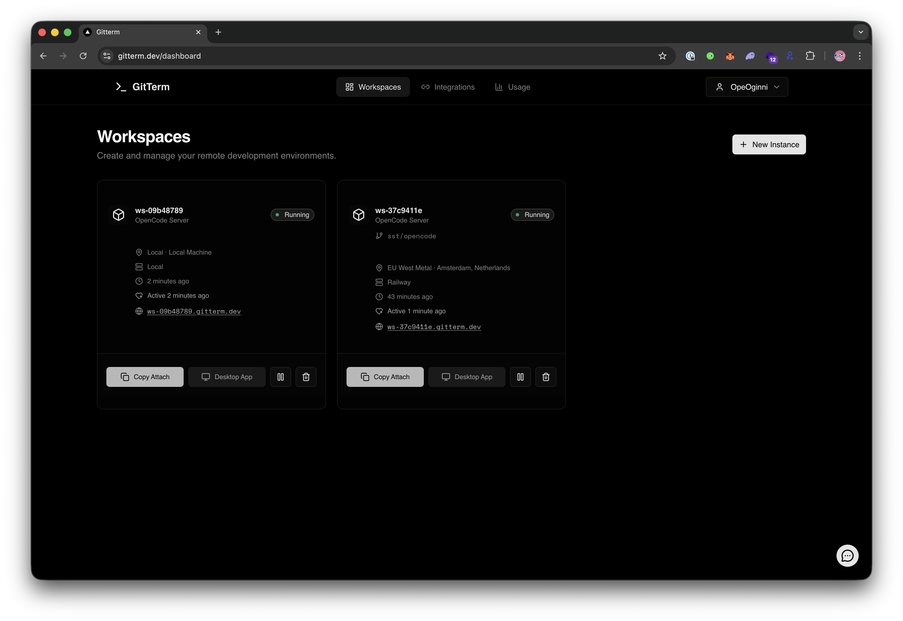

# GitTerm

Run AI coding agents your way. Connect agents running in the cloud or tunnel your local development setup through secure URLs.

Currently supports: **OpenCode**.

> **Note:** This README covers self-hosting GitTerm. For the managed service, visit [gitterm.dev](https://gitterm.dev).

[](https://railway.com/deploy/gitterm?referralCode=o9MFOP&utm_medium=integration&utm_source=template&utm_campaign=generic)

## What is GitTerm?

GitTerm gives you flexible ways to run AI coding agents:

1. **Cloud Workspaces** - Spin up cloud-based environments where your agent runs remotely. Access via browser or API.

2. **Local Tunnels** - Run your agent locally, then expose it through a secure tunnel.

Both modes work with supported agents (currently OpenCode). Cloud workspaces handle heavy computation remotely, while local tunnels give you full control over your local setup, from any location. Both ways are secured meaning no unauthenticated access to your workspaces.



## Self-Hosting Guide

### Deploy on Railway (Recommended)

The fastest way to deploy your own GitTerm instance:

1. Click the **Deploy on Railway** button above
2. Configure the required environment variables as prompted (ADMIN_EMAIL, ADMIN_PASSWORD, etc.)
3. Add your custom domain to the proxy service

Caddy handles all routing through a single domain.

### Architecture

```
┌─────────────────────────────────────────────────────────────────┐
│                      Caddy Proxy                                │
│        (Path-based: /ws/{workspace-id}/ → workspaces)          │
└──────────────┬────────────────────────────┬─────────────────────┘
               │                            │
               ▼                            ▼
┌──────────────────────────┐   ┌──────────────────────────────────┐
│   Cloud Agent Runtime    │   │         Tunnel Proxy             │
│  (agent runs in cloud)   │   │   (WebSocket multiplexing)       │
│                          │   │                                  │
│  e.g., OpenCode via      │   │   tunnels local agents           │
│  browser or API access   │   │   to the internet                │
└──────────────────────────┘   └──────────────┬───────────────────┘
                                              │
                                              ▼
                               ┌──────────────────────────────────┐
                               │      gitterm-agent (CLI)         │
                               │   (connects local agents)        │
                               └──────────────────────────────────┘
```

**How it works:**

- **Cloud Workspaces**: Agent runs in a Railway container, accessible via browser/API
- **Local Tunnels**: Agent runs on your machine, connected via `gitterm-agent` CLI

**Self-hosted URL format:**

```
# All workspaces use /ws/ path routing
https://your-domain.com/ws/{workspace-id}/
```

### Required Services

| Service      | Purpose                       | Recommended Platform |
| ------------ | ----------------------------- | -------------------- |
| PostgreSQL   | Database                      | Railway Postgres     |
| Redis        | Caching, pub/sub              | Railway Redis        |
| server       | Main API                      | Railway              |
| web          | Frontend (dashboard, auth UI) | Railway              |
| tunnel-proxy | WebSocket tunnel server       | Railway              |
| proxy        | Caddy reverse proxy           | Railway              |
| listener     | Webhooks (GitHub, Railway)    | Railway              |
| worker       | Background jobs               | Railway              |

All services route through Caddy on a single domain.

### Worker Cron Jobs

GitTerm has two background workers that run as cron jobs:

| Worker          | Schedule                            | Purpose                                   |
| --------------- | ----------------------------------- | ----------------------------------------- |
| **idle-reaper** | Every 10 minutes (`*/10 * * * *`)   | Stops idle workspaces and enforces quotas |
| **daily-reset** | Daily at midnight UTC (`0 0 * * *`) | Logs daily usage statistics               |

**On Railway:** These workers are configured with their respective `railway.json` files. Make sure to:

1. Deploy the worker service with `railway.config.json` for idle-reaper (runs every 10 min)
2. Deploy the worker service with `railway.daily-reset.json` for daily-reset (runs once daily)

**Locally:** You can run workers manually:

```bash
# Run idle reaper once (for testing)
cd apps/worker && bun run dist/idle-reaper.mjs

# Run daily reset once (for testing)
cd apps/worker && bun run dist/daily-reset.mjs
```

### Local Tunnels (for agents running locally)

Connect your local agent setup to the internet through a secure tunnel:

```bash
# Install the agent CLI
npm install -g @opeoginni/gitterm-agent

# Login (device code flow)
npx @opeoginni/gitterm-agent login -s https://your-api-domain.com

# Create a workspace with tunnelType="local" in the dashboard
# Then connect your local server
npx @opeoginni/gitterm-agent connect --workspace-id "workspace-id" --port 3000
```

**URL Format:**

```
# Your tunnel URL (self-hosted, path-based)
https://your-domain.com/ws/workspace-id/

# Managed service (subdomain)
https://workspace-id.gitterm.dev/
```

Your local agent is now accessible through the tunnel URL.

### How Local Tunnels Work

1. **Create a workspace** with `tunnelType: "local"` via the dashboard
2. **Run the agent** on your machine where your coding agent is running
3. **Agent authenticates** via device code flow and gets a tunnel JWT
4. **Agent connects** to the tunnel-proxy via WebSocket
5. **Incoming requests** to your tunnel URL are routed to the tunnel-proxy
6. **Tunnel-proxy multiplexes** the request over WebSocket to your local agent
7. **Agent forwards** the request to your local server and streams the response back

## Development Setup

For contributors who want to run GitTerm locally.

### Prerequisites

- [Bun](https://bun.sh) (v1.0+)
- [Docker](https://docker.com) (for local Postgres & Redis)
- Node.js 18+ (for some tooling)

### 1. Clone and Install

```bash
git clone https://github.com/OpeOginni/gitterm.git
cd gitterm
bun install
```

### 2. Set Up Environment Variables

```bash
# Apps
cp apps/server/.env.example apps/server/.env
cp apps/web/.env.example apps/web/.env
cp apps/tunnel-proxy/.env.example apps/tunnel-proxy/.env
cp apps/listener/.env.example apps/listener/.env
cp apps/worker/.env.example apps/worker/.env
```

### 3. Start Local Services

```bash
# Start Postgres
bun turbo db:start

# Start Redis
bun turbo redis:start
```

### 4. Set Up Database

```bash
# Push schema to database
bun run db:push
```

### 5. Run Development Servers

```bash
# Run all services
bun run dev

# Or run specific apps
bun run dev --filter=web
bun run dev --filter=server
bun run dev --filter=tunnel-proxy
```

| Service      | URL                   |
| ------------ | --------------------- |
| Web App      | http://localhost:3001 |
| API Server   | http://localhost:3000 |
| Tunnel Proxy | http://localhost:9000 |

## Project Structure

```
gitterm/
├── apps/
│   ├── web/              # Next.js frontend (dashboard, auth UI)
│   ├── server/           # Main API server (Hono + tRPC)
│   ├── listener/         # Webhook listener (GitHub, Railway events)
│   ├── tunnel-proxy/     # WebSocket tunnel proxy for local tunnels
│   ├── proxy/        # Caddy configuration for routing
│   └── worker/           # Background jobs (cleanup, daily reset)
│
├── packages/
│   ├── agent/            # CLI tool (@opeoginni/gitterm-agent)
│   ├── api/              # Shared API logic, routers, services
│   ├── auth/             # Authentication (Better Auth)
│   ├── db/               # Database schema & migrations (Drizzle + Postgres)
│   ├── redis/            # Redis repositories (tunnels, rate limiting)
│   └── schema/           # Shared Zod schemas
```

## Tech Stack

- **Runtime**: [Bun](https://bun.sh)
- **Frontend**: Next.js, TailwindCSS, shadcn/ui
- **Backend**: Hono, tRPC
- **Database**: PostgreSQL + Drizzle ORM
- **Cache/Pub-Sub**: Redis
- **Auth**: Better Auth (GitHub OAuth)
- **Monorepo**: Turborepo
- **Proxy**: Caddy
- **Deployment**: Railway

## Available Scripts

```bash
bun run dev           # Start all apps in development mode
bun run build         # Build all apps
bun run check-types   # TypeScript type checking
bun run db:push       # Push schema changes to database
bun run db:studio     # Open Drizzle Studio (database UI)
bun run db:generate   # Generate migrations
bun run db:migrate    # Run migrations
```

## Contributing

Contributions are welcome! Please read the development setup section above.

## License

This project is licensed under the **MIT License**.

See [LICENSE](LICENSE) for the full text.

## Links

- [Website](https://gitterm.dev) - Managed service
- [OpenCode](https://opencode.ai) - AI coding agent
- [Agent NPM Package](https://www.npmjs.com/package/@opeoginni/gitterm-agent)
- [GitHub](https://github.com/OpeOginni/gitterm)
